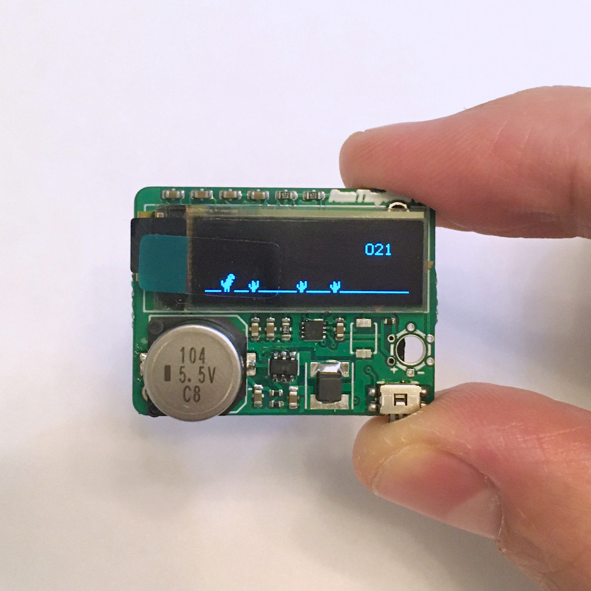
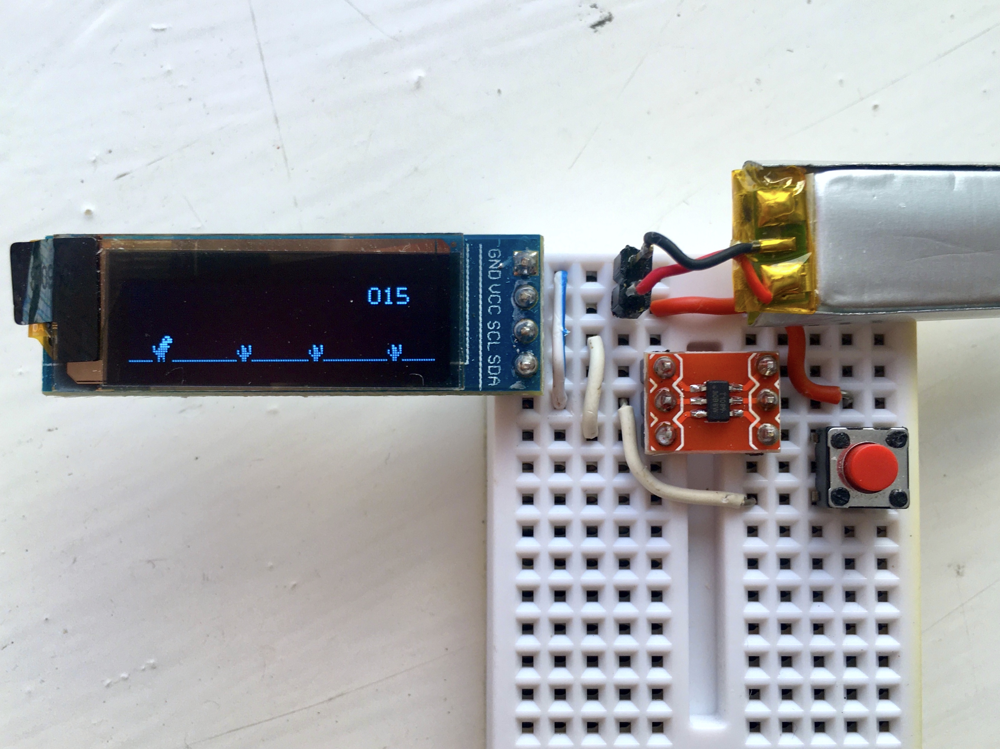
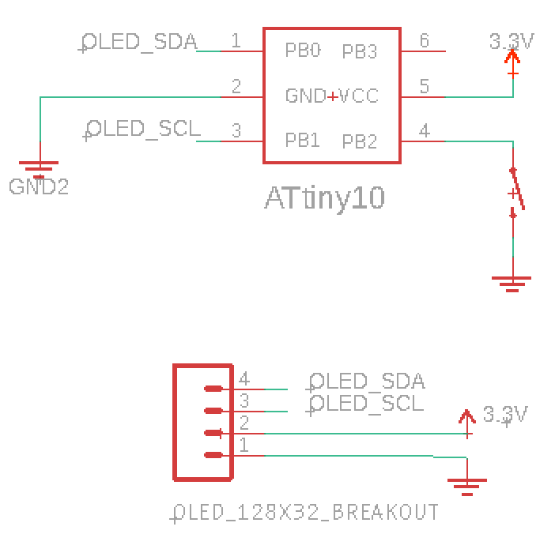

# RunTiny
Endless runner game developed for the AVR ATtiny10 microcontroller and a 128x32 monochrome OLED Display.


The entire code is written in assembly to optimize the space and fit it into the 1kB flash memory. 
The firmware, that occupies 778 bytes in total, contains the game as well as handling the microcontroller I/O and display communication through TWI.

## Solar Powered Keychain



RunTiny lives on a small pcb of just 33mm by 25mm. It's powered by a 1V solar cell that charges a supercapacitor through a boost converter, so no batteries are needed.
A 0.1F supercapacitor needs a few seconds of direct sunlight to charge. After that, the game can run an unlimited time with a lower light intensity. Once fully charged, the energy stored is enough to play for 20 or 30 seconds with no light.

The PCB gerber files are in the hardware folder. The passive components footprint is mostly 0603 but there are three 0402 resistors. Besides this, it's fairly easy to build and more details are [here](http://www.bitbanging.space/posts/smallest-solar-powered-videogame).

## Usage
The game mechanics is quite intuitive: use the button to jump the obstacles.
When an obstacle hits the player the microcontroller goes into sleep mode. A new button press will awake the microcontroller and restart the game.
<div></div>


## Make your own
RunTiny needs just three components in its simplest form:
- ATtiny10 (and breakout board)
- OLED Display 128x31 (SSD1306)
- Push-button

plus some wires, a breadboard and a power source.


### Wiring
The ATtiny10 has 3 usable I/O (PB3 is the reset) and are all used as follows:
- PB0: SDA
- PB1: SCL
- PB2: Push-button (INT0)

This schematic shows the circuit connections:
<div></div>

### Power Source
Anything between 3.3V-4.5V will do. 
Tested with:
- 1S 150mAh Lipo 
- CR2032 button battery.

## Firmware Build
If you use PlatformIO you can follow [this guide](http://www.bitbanging.space/posts/attiny10-programming-platformio-terminal). It shows how to set-up the ATtiny10 environment. After that, it's very easy to compile and upload the firmware on the chip. 
As an alternative, it can be compiled using avr-gcc directly.

## Firmware Upload
If you just want to upload the firmware, you can do so using avrdude and USBASP. 

Be sure the USBASP jumper is set on 5V and the firmware is up to date (the firmware loaded on most devices sold doesn't support TPI required for the ATTiny10). You can use [these instructions](http://www.bitbanging.space/posts/usbasp-firmware-update) to update the USBASP firmware.

Use this command (mind the paths of avrdude and its config file):
```
./avrdude -e -v -p attiny10 -C ./avrdude.conf -c usbasp -U flash:w:firmware.hex:i -P usb
```

## ATtiny85 and more
The game should work on other AVR devices (i.e. ATtiny85) with minor changes (not tested yet though).